# 🎓 Meetup Killer — Assistant de Cours IA

🇬🇧 [English version](./README.md)

[](https://github.com/Alithiel31/ParseAndCutV2/actions/workflows/lint.yml)
[](https://github.com/Alithiel31/ParseAndCutV2/actions/workflows/integration.yml)
[](https://www.python.org/)
[](https://fastapi.tiangolo.com/)
[](https://react.dev/)
[](https://www.typescriptlang.org/)
[](https://vite.dev/)
[](https://www.docker.com/)
[](https://nginx.org/)
[](https://www.raspberrypi.com/)
[](https://groq.com/)
[](https://parseandcut.alithiel31.dev)
[](https://www.cloudflare.com/)
[](https://opensource.org/licenses/MIT)

> 🚀 **Service en ligne** : [parseandcut.alithiel31.dev](https://parseandcut.alithiel31.dev)

**Meetup Killer** transforme vos enregistrements audio de cours ou de réunions en fiches de révision structurées au format Markdown — ou, si vous préférez juste la transcription brute, c'est possible aussi. Conçu pour tourner sur **Raspberry Pi**, déployé via **Docker**, exposé publiquement via un **tunnel Cloudflare** — aucun port ouvert sur le routeur. Le traitement lourd est délégué à l'API **Groq** (Whisper Large V3 pour la transcription, GPT-OSS 120B pour la structuration).

## Sommaire

- [Stack & compétences](#stack--compétences)
- [Fonctionnalités](#fonctionnalités)
- [Formats audio supportés](#formats-audio-supportés)
- [Architecture](#architecture)
- [Variables d'environnement](#variables-denvironnement)
- [Installation locale](#installation-locale)
- [Déploiement (Docker + Raspberry Pi)](#déploiement-docker--raspberry-pi)
- [Tests & CI](#tests--ci)
- [Releases & versioning](#releases--versioning)
- [Contribuer](#contribuer)
- [Licence](#licence)

## Stack & compétences

Ce projet couvre, de bout en bout :

- **Backend** : FastAPI + Uvicorn (Python 3.10), migré depuis une implémentation Flask d'origine
- **Traitement audio** : FFmpeg (découpage des enregistrements longs pour respecter la limite Groq de 25 Mo par fichier)
- **IA** : API Groq — Whisper Large V3 (transcription) + GPT-OSS 120B (structuration)
- **Frontend** : [`frontend/`](./frontend) — Progressive Web App React + Vite, packagée en TWA (Trusted Web Activity) pour Android
- **Conteneurisation & déploiement** : Docker Compose (conteneurs backend + frontend), cible Raspberry Pi via un `docker context`, tunnel Cloudflare pour le HTTPS/l'accès public sans ouverture de port — voir [`docs/DEPLOY_PI.md`](./docs/DEPLOY_PI.md)
- **CI/CD** : GitHub Actions — lint (flake8 pour le backend, oxlint pour le frontend), tests unitaires (pytest) et tests d'intégration (démarrage de l'app FastAPI, `/health`, cas d'erreur de `/process`) à chaque push/PR
- **Historique opérationnel** : migration de la plateforme d'hébergement de Railway vers une infra auto-hébergée Docker/Pi — voir [`docs/Troubleshooting.fr.md`](./docs/Troubleshooting.fr.md)
- **Documentation** : changelog versionné ([Keep a Changelog](https://keepachangelog.com/en/1.0.0/)), releases taguées (SemVer)

## Fonctionnalités

| Fonctionnalité | Détail |
|---|---|
| 🎙️ Transcription longue durée | Découpage automatique en chunks de 10 min — **supporte les audios > 1h** |
| 🧠 Fiche structurée | Résumé, titres hiérarchiques, mots-clés en gras, blocs définition |
| 🔀 Deux modes de sortie | Résumé IA ou transcription brute au choix, par upload — le mode transcription saute entièrement l'appel LLM, et fournit des horodatages par segment |
| 🌐 Interface moderne | Drag & drop, barre de progression par étape, affichage des stats |
| ✅ Validation robuste | Vérification type + taille côté client ET serveur |
| 🔁 Retry automatique | Relance Whisper en cas de timeout réseau (backoff exponentiel) |
| 🐳 Docker ready | FFmpeg + Uvicorn pré-configurés, image légère `python:3.10-slim` |
| 📊 Endpoint `/health` | Monitoring : état Groq, langue, extensions supportées |
| ⚖️ Pages légales | CGU, politique de confidentialité et mentions légales servies par le PWA (`/cgu`, `/politique-de-confidentialite`, `/mentions-legales`) |

## Formats audio supportés

`mp3` · `mp4` · `wav` · `m4a` · `ogg` · `webm` · `flac` · `aac` · `opus`

## Architecture

```mermaid
flowchart LR
    U["Utilisateur (navigateur / TWA)"] -->|upload audio| FE

    subgraph Pi["Raspberry Pi (Docker Compose)"]
        TRA["Traefik<br/>reverse proxy · :8000"]
        FE["conteneur frontend<br/>nginx · frontend/<br/>traefik-net"]
        BE["conteneur backend<br/>FastAPI + Uvicorn<br/>:5000 (interne uniquement)"]
        TRA -->|"Host: parseandcut.alithiel31.dev"| FE
        FE -->|reverse-proxy /api/*| BE
    end

    BE -->|FFmpeg| CHUNK["chunks de 10 min"]
    CHUNK -->|Whisper Large V3| TXT["transcription brute"]
    TXT -->|"mode=summary"<br/>GPT-OSS 120B| MD["Markdown structuré"]
    TXT -->|"mode=transcript"| RAW["transcription brute renvoyée telle quelle"]

    TUN["Tunnel Cloudflare<br/>parseandcut.alithiel31.dev"] --> TRA
    U -.->|accès public| TUN
```



Nginx (conteneur frontend) sert les fichiers statiques du PWA et reverse-proxy `/api/` vers le backend — same-origin, pas de CORS à gérer en production. Traefik (reverse proxy partagé sur le Pi) route le nom d'hôte public vers le conteneur frontend via `traefik-net`, sans exposer de port dédié sur l'hôte. Le tunnel Cloudflare gère le HTTPS et le nom de domaine — aucun certificat à gérer manuellement, aucun port ouvert sur le routeur.

## Variables d'environnement

| Variable | Obligatoire | Défaut | Description |
|---|---|---|---|
| `GROQ_API_KEY` | ✅ | — | Clé API Groq ([console.groq.com](https://console.groq.com/)) |
| `LANGUAGE` | ❌ | `fr` | Langue de transcription Whisper |
| `PORT` | ❌ | `5000` | Port d'écoute du backend |
| `CHUNK_DURATION_SEC` | ❌ | `600` | Durée des chunks en secondes |
| `FFMPEG_PATH` | ❌ | `ffmpeg` | Chemin vers le binaire FFmpeg |
| `CORS_ORIGINS` | ❌ | `https://parseandcut.alithiel31.dev` | Origines autorisées séparées par des virgules — à surcharger en dev local (Vite sur `:5173` qui tape sur Uvicorn sur `:5000`) |
| `MAX_UPLOAD_SIZE_MB` | ❌ | `300` | Taille max d'upload vérifiée côté backend (en plus du `client_max_body_size` de nginx) |
| `RATE_LIMIT_PROCESS` | ❌ | `5/minute` | Limite de requêtes sur `/process` (par IP), format `N/period` |
| `FLASK_DEBUG` | ❌ | `false` | Mode debug (dev uniquement) |

## Installation locale

1. **Cloner le dépôt**

   ```bash
   git clone https://github.com/Alithiel31/ParseAndCutV2.git
   cd ParseAndCutV2
   ```

2. **Configurer le `.env`**

   ```bash
   cp ".env exemple" .env
   ```

   Renseigner `GROQ_API_KEY` au minimum.

3. **Lancer avec Docker**

   ```bash
   docker build -t meetup-killer .
   docker run -d -p 5000:5000 --name meetup-app --env-file .env meetup-killer
   ```

   Ou sans Docker (Python 3.10 + FFmpeg installés localement) :

   ```bash
   pip install -r requirements.txt
   python -m app.main
   ```

4. **Accéder à l'outil** sur [http://localhost:5000](http://localhost:5000)

   > Sur Raspberry Pi, remplacer `localhost` par l'IP locale de la machine.

## Déploiement (Docker + Raspberry Pi)

C'est la méthode utilisée en production. Le `docker-compose.yml` de ce dépôt lance le backend (réseau interne, port **5000**) et le frontend [`frontend/`](./frontend) (nginx, routé via Traefik sur `traefik-net`, aucun port exposé sur l'hôte) — voir [`docs/DEPLOY_PI.md`](./docs/DEPLOY_PI.md) pour la procédure complète (création du `docker context` vers le Pi, build, configuration des labels Traefik et de l'ingress Cloudflare).

```bash
docker context use rpi
docker compose up --build -d
```

L'endpoint [`/health`](https://parseandcut.alithiel31.dev/api/health) permet de vérifier l'état du service à tout moment.

## Tests & CI

```bash
# Lint — mêmes vérifications que le workflow lint.yml
npm run lint                    # flake8 (backend)
cd frontend && npm run lint     # oxlint (frontend)

# Tests unitaires (routes FastAPI, FFmpeg/Groq mockés) — comme le workflow integration.yml
pytest
```

Deux workflows tournent à chaque push/PR sur `main` :

- **CI Lint** (`.github/workflows/lint.yml`) : flake8 (backend), oxlint (frontend)
- **CI Integration** (`.github/workflows/integration.yml`) : lance la suite pytest, puis démarre l'app FastAPI et vérifie `/`, `/health`, ainsi que les cas d'erreur de `/process` (fichier manquant → 400, format non supporté → 415)

## Releases & versioning

Ce projet suit le [Semantic Versioning](https://semver.org/) (`MAJOR.MINOR.PATCH`) et [Keep a Changelog](https://keepachangelog.com/en/1.0.0/). Chaque changement notable est d'abord ajouté dans [`CHANGELOG.md`](./CHANGELOG.md) sous `[Unreleased]`, puis sous une section de version une fois tagué :

```bash
git tag -a vX.Y.Z -m "vX.Y.Z"
git push origin vX.Y.Z
```

Une Release GitHub est ensuite créée à partir du tag, avec sa description reprise de la section correspondante du `CHANGELOG.md`.

## Contribuer

Voir [`docs/CONTRIBUTING.fr.md`](./docs/CONTRIBUTING.fr.md) pour l'environnement de développement, comment reproduire les vérifications de la CI en local, et le format des PR/releases.

## Sécurité

Voir [`docs/SECURITY.fr.md`](./docs/SECURITY.fr.md) pour signaler une vulnérabilité.

## Licence

MIT (voir le champ `license` dans [`package.json`](./package.json)).
