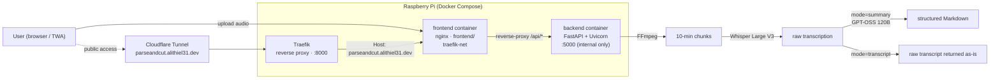

# 🎓 Meetup Killer — AI Course Assistant

🇫🇷 [Version française](./README.fr.md)

[](https://github.com/Alithiel31/ParseAndCutV2/actions/workflows/lint.yml)
[](https://github.com/Alithiel31/ParseAndCutV2/actions/workflows/integration.yml)
[](https://www.python.org/)
[](https://fastapi.tiangolo.com/)
[](https://react.dev/)
[](https://www.typescriptlang.org/)
[](https://vite.dev/)
[](https://www.docker.com/)
[](https://nginx.org/)
[](https://www.raspberrypi.com/)
[](https://groq.com/)
[](https://parseandcut.alithiel31.dev)
[](https://www.cloudflare.com/)
[](https://opensource.org/licenses/MIT)

> 🚀 **Live service**: [parseandcut.alithiel31.dev](https://parseandcut.alithiel31.dev)

**Meetup Killer** turns audio recordings of lectures or meetings into structured Markdown study notes — or, if you just want the raw transcript, that too. Built to run on a **Raspberry Pi**, deployed via **Docker**, exposed publicly through a **Cloudflare Tunnel** — no port forwarding. Heavy processing is offloaded to the **Groq API** (Whisper Large V3 for transcription, GPT-OSS 120B for structuring).

## Table of contents

- [Stack & skills](#stack--skills)
- [Features](#features)
- [Supported audio formats](#supported-audio-formats)
- [Architecture](#architecture)
- [Environment variables](#environment-variables)
- [Local setup](#local-setup)
- [Deployment (Docker + Raspberry Pi)](#deployment-docker--raspberry-pi)
- [Testing & CI](#testing--ci)
- [Releases & versioning](#releases--versioning)
- [Contributing](#contributing)
- [License](#license)

## Stack & skills

This project covers, end to end:

- **Backend**: FastAPI + Uvicorn (Python 3.10), migrated from an original Flask implementation
- **Audio processing**: FFmpeg (chunking long recordings for the Groq 25 MB per-file limit)
- **AI**: Groq API — Whisper Large V3 (transcription) + GPT-OSS 120B (structuring)
- **Frontend**: [`frontend/`](./frontend) — React + Vite Progressive Web App, packaged as a TWA (Trusted Web Activity) for Android
- **Containerization & deployment**: Docker Compose (backend + frontend containers), Raspberry Pi target via a `docker context`, Cloudflare Tunnel for HTTPS/public access with no port forwarding — see [`docs/DEPLOY_PI.md`](./docs/DEPLOY_PI.md)
- **CI/CD**: GitHub Actions — linting (flake8 for the backend, oxlint for the frontend), unit tests (pytest), and integration tests (FastAPI app boot, `/health`, `/process` error paths) on every push/PR
- **Operational history**: migrated the hosting platform from Railway to a self-hosted Docker/Pi setup — see [`docs/Troubleshooting.md`](./docs/Troubleshooting.md)
- **Documentation**: versioned changelog ([Keep a Changelog](https://keepachangelog.com/en/1.0.0/)), tagged releases (SemVer)

## Features

| Feature | Detail |
|---|---|
| 🎙️ Long audio support | Auto-split into 10-min chunks — **handles recordings over 1 hour** |
| 🧠 Structured notes | Summary, hierarchical headings, bold keywords, definition blocks |
| 🔀 Two output modes | Pick AI summary or raw transcript per upload — transcript mode skips the LLM call entirely, and comes with per-segment timestamps |
| 🌐 Modern UI | Drag & drop, step-by-step progress bar, processing stats |
| ✅ Robust validation | File type + size checked both client-side and server-side |
| 🔁 Auto retry | Whisper retried on network timeout with exponential backoff |
| 🐳 Docker ready | FFmpeg + Uvicorn pre-configured, lightweight `python:3.10-slim` image |
| 📊 `/health` endpoint | Monitoring: Groq status, language, supported formats |
| ⚖️ Legal pages | Terms, privacy policy and legal notice served by the PWA (`/cgu`, `/politique-de-confidentialite`, `/mentions-legales`) |

## Supported audio formats

`mp3` · `mp4` · `wav` · `m4a` · `ogg` · `webm` · `flac` · `aac` · `opus`

## Architecture



Nginx (frontend container) serves the PWA static files and reverse-proxies `/api/` to the backend — same-origin, no CORS to manage in production. Traefik (shared reverse proxy on the Pi) routes the public hostname to the frontend container via `traefik-net`, without exposing a dedicated port on the host. The Cloudflare Tunnel handles HTTPS and the domain name — no certificate to manage manually, no port opened on the router.

## Environment variables

| Variable | Required | Default | Description |
|---|---|---|---|
| `GROQ_API_KEY` | ✅ | — | Groq API key ([console.groq.com](https://console.groq.com/)) |
| `LANGUAGE` | ❌ | `fr` | Whisper transcription language |
| `PORT` | ❌ | `5000` | Port the backend listens on |
| `CHUNK_DURATION_SEC` | ❌ | `600` | Chunk duration in seconds |
| `FFMPEG_PATH` | ❌ | `ffmpeg` | Path to the FFmpeg binary |
| `CORS_ORIGINS` | ❌ | `https://parseandcut.alithiel31.dev` | Comma-separated allowed origins — override for local dev (Vite on `:5173` calling Uvicorn on `:5000`) |
| `MAX_UPLOAD_SIZE_MB` | ❌ | `300` | Max upload size enforced by the backend (in addition to nginx's `client_max_body_size`) |
| `RATE_LIMIT_PROCESS` | ❌ | `5/minute` | Rate limit on `/process` (per IP), format `N/period` |
| `FLASK_DEBUG` | ❌ | `false` | Debug mode (dev only) |

## Local setup

1. **Clone the repository**

   ```bash
   git clone https://github.com/Alithiel31/ParseAndCutV2.git
   cd ParseAndCutV2
   ```

2. **Create your `.env` file**

   ```bash
   cp ".env exemple" .env
   ```

   Fill in `GROQ_API_KEY` at minimum.

3. **Run with Docker**

   ```bash
   docker build -t meetup-killer .
   docker run -d -p 5000:5000 --name meetup-app --env-file .env meetup-killer
   ```

   Or without Docker (Python 3.10 + FFmpeg installed locally):

   ```bash
   pip install -r requirements.txt
   python -m app.main
   ```

4. **Open the app** at [http://localhost:5000](http://localhost:5000)

   > On Raspberry Pi, replace `localhost` with the device's local IP address.

## Deployment (Docker + Raspberry Pi)

This is the production setup. This repo's `docker-compose.yml` runs the backend (internal network, port **5000**) and the [`frontend/`](./frontend) PWA (nginx, routed via Traefik on `traefik-net`, no port exposed on the host) — see [`docs/DEPLOY_PI.md`](./docs/DEPLOY_PI.md) for the full procedure (creating the `docker context` to the Pi, building, configuring the Traefik labels and the Cloudflare ingress).

```bash
docker context use rpi
docker compose up --build -d
```

Check the [`/health`](https://parseandcut.alithiel31.dev/api/health) endpoint anytime to verify service status.

## Testing & CI

```bash
# Linting — same checks as the lint.yml workflow
npm run lint                    # flake8 (backend)
cd frontend && npm run lint     # oxlint (frontend)

# Unit tests (FastAPI routes mocked against FFmpeg/Groq) — same as the integration.yml workflow
pytest
```

Two workflows run on every push/PR to `main`:

- **CI Lint** (`.github/workflows/lint.yml`): flake8 (backend), oxlint (frontend)
- **CI Integration** (`.github/workflows/integration.yml`): runs the pytest suite, then boots the FastAPI app and checks `/`, `/health`, and the `/process` error paths (missing file → 400, unsupported format → 415)

## Releases & versioning

This project follows [Semantic Versioning](https://semver.org/) (`MAJOR.MINOR.PATCH`) and [Keep a Changelog](https://keepachangelog.com/en/1.0.0/). Every notable change lands in [`CHANGELOG.md`](./CHANGELOG.md) under `[Unreleased]` first, then under a version heading once tagged:

```bash
git tag -a vX.Y.Z -m "vX.Y.Z"
git push origin vX.Y.Z
```

A GitHub Release is then created from the tag, with its description copied from the matching `CHANGELOG.md` section.

## Contributing

See [`docs/CONTRIBUTING.md`](./docs/CONTRIBUTING.md) for the development environment, how to reproduce the CI checks locally, and the PR/release format.

## Security

See [`docs/SECURITY.md`](./docs/SECURITY.md) to report a vulnerability.

## License

MIT (see `license` field in [`package.json`](./package.json)).
